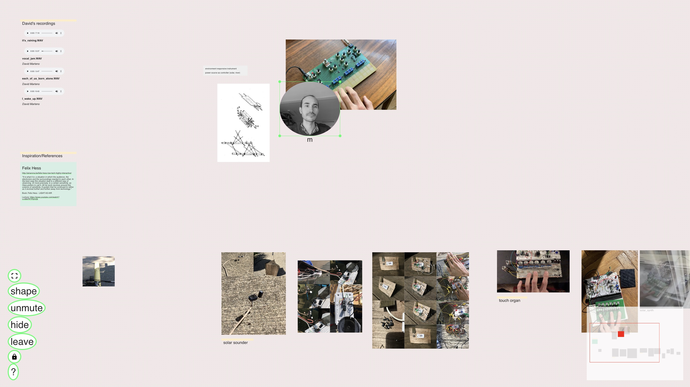

# Live Agora

... a playful space for exchange and sharing  

Live Agora offers collaborative 2D spaces where participants can meet, gather, and arrange various media (streams and files) together. Traces left in spaces are persisted, allowing groups to build collective memory to according to their own needs and values.

Please note: this is experimental software. Expect rough edges and evolving features.

## Screenshots

## Getting started

Here are some agoras you can explore:

* welcome: https://taat.live/agora
* hall09: https://taat.live/agora/hall09
* pillipallis: https://taat.live/agora/pillipallis

You can also explore an open-access demo agora at https://taat.live/agora/demo.

How to enter:
1. type in your name and tap enter
2. tap on **unmute** to let others hear you and **show** to let others see you

Feel free to explore the space, enter the call, leave a note. Please be kind.

## Setting up your own agora

If you want to create your own agora, you'll need to either:

* host your own instance (documentation coming soon)
* join a community instance

We are also piloting a non-profit hosted offer for those who prefer a managed service. If you want to be a part of this, or have any questions or comments, reach out to agora@taat.live.

## License

The Live Agora codebase is released under the [GNU Affero General Public License v3](./LICENSE). You are welcome to use, modify, and host an instance yourself. Please respect the license terms.

## Documentation

For participants (coming soon)  
For instance admins (coming soon)  
[Local development](./docs/Development.md)  

## Contributing

You can support the project by:

* sharing feedback: let us know how you're using it. bug reports/ideas for improvement are welcome.
* participating in the design process: sketches, discussions, suggestions
* contributing code changes: via pull requests (please open an issue first)
* funding the work that goes into this

Feel free to send your feedback via email to agora@taat.live if you don't have a github account.

## History

* 2021: first experiments within "Encounter Activism" project
* 2021: first Live Assembly
* 2023: commission from Kulturstiftung der Länder / MitbeStimmungsorte ("Places for Participation")
* 2024: piloting community version
* 2025: 2nd place in the European Social Innovation Competition for Digital Democracy

## Roadmap

* workspace ui to easily create and manage agoras
* portability: reduce/replace third-party dependencies
* care/cleanup/maintenance
* documentation
* peer-to-peer version
* local-first file storage
* nextcloud file storage integration

## Acknowledgements

Live Agora started as a situational application created with and for [TAAT](https://taat.live). Built on the shoulder of giants:

* yjs
* xyflow
* tiptap
* hocuspocus
* ffmpeg